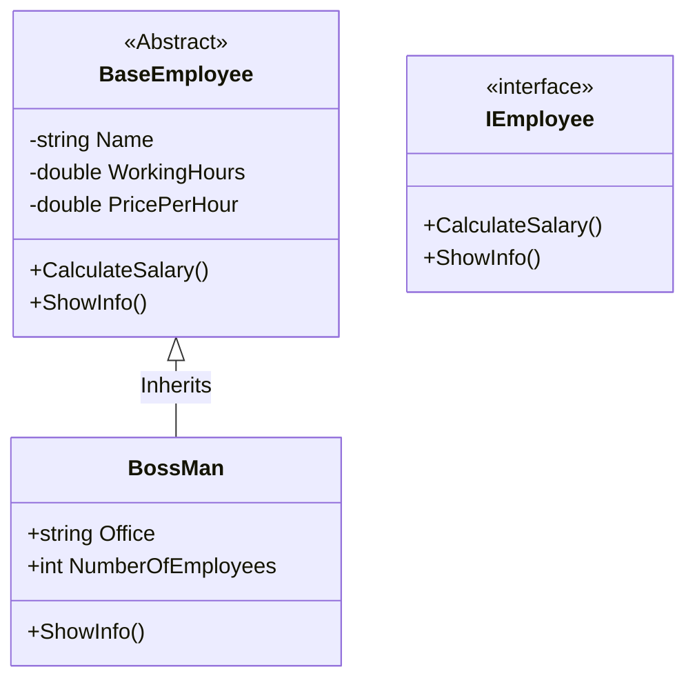

---
### ClassDiagram:

```mermaid
classDiagram

class BaseEmployee {
	<<Abstract>>
	
	-string Name
	-double WorkingHours
	-double PricePerHour
	+CalculateSalary()
	+ShowInfo()
}

  

class BossMan {
	+string Office
	+int NumberOfEmployees
	+ShowInfo()
}

class IEmployee {
	<<interface>>
	
	+CalculateSalary()
	+ShowInfo()
}
  

BaseEmployee <|-- BossMan : Inherits
```